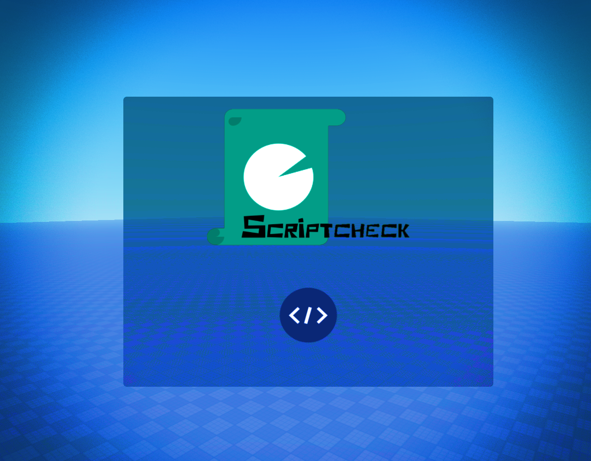

# Scriptview local DEX

  

__Using Scriptview and copying and pasting everything then republishing is highly restricted. Do not do this or we will take action.__

Scriptview is a dex explorer script for roblox. Any exploits involving Scriptview is not our fault. For more information click the button down below this line.

To load Viewscript copy LS.lua

<a href="https://docs.google.com/document/d/1mEHrmc_s5H8VJA9i2nJWxkuXF6WlqIyE-dqz3YlZk8k/edit?tab=t.0" target="_blank" style="
  background-color: teal;
  color: white;
  font-size: 16px;
  padding: 10px 18px;
  border-radius: 8px;
  text-decoration: none;
  font-family: sans-serif;
">
  Viewscript Documentary
</a>

